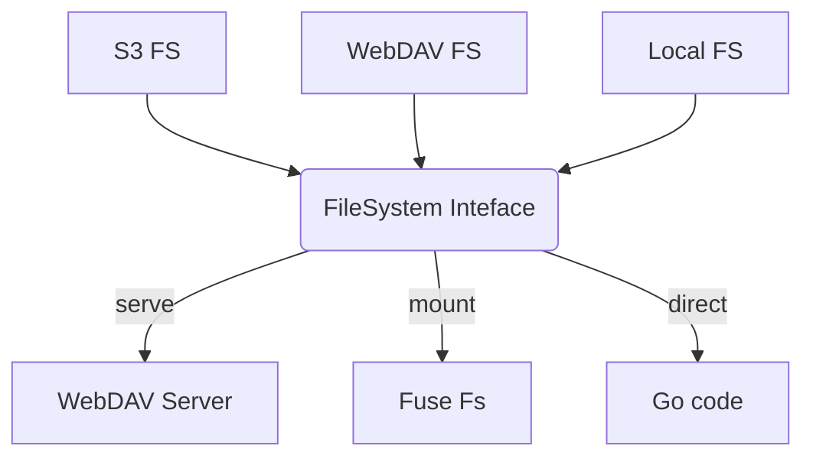

# UniFS

```mermaid
flowchart TB 
    s3_fs[S3 FS]
    local_fs[Local FS]
    webdav_fs[WebDAV FS]

    fsi(FileSystem Inteface)

    s3_fs & webdav_fs & local_fs --> fsi

    webdav_server[WebDAV Server]
    fuse_fs[Fuse Fs]
    go_code[Go code]

    fsi -->|serve| webdav_server
    fsi -->|mount| fuse_fs
    fsi -->|direct| go_code
```