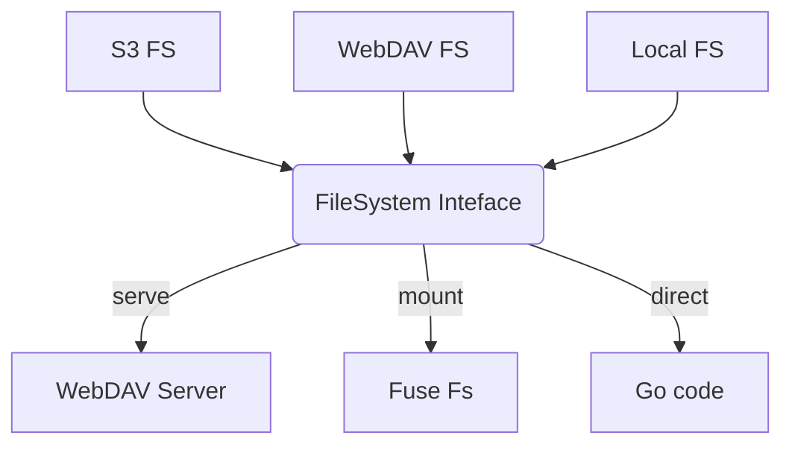

# UniFS



### Supported Backends

```
webdav://<username>:<password>@<host>[<bath_path>][?insecure=true]

s3://<access_key_id>:<access_key_secret>@<host>/<bucket>[<bath_path>][?insecure=true]

file://<absolute_path>
```

### CSI

### Create StorageClass

```yaml
apiVersion: storage.k8s.io/v1
kind: StorageClass
metadata:
  name: unifs
provisioner: csi-driver.unifs.octohelm.tech
parameters:
  csi.storage.k8s.io/provisioner-secret-name: "${pvc.name}"
  csi.storage.k8s.io/provisioner-secret-namespace: "${pvc.namespace}"
  csi.storage.k8s.io/node-publish-secret-name: "${pvc.name}"
  csi.storage.k8s.io/node-publish-secret-namespace: "${pvc.namespace}"
reclaimPolicy: Delete
```

### Create Secret && PersistentVolumeClaim
```yaml
---
apiVersion: v1
kind: Secret
metadata:
  name: fuse-file
  namespace: storage-system--unifs
type: Opaque
stringData:
  backend: file:///data/unifs
---
apiVersion: v1
kind: PersistentVolumeClaim
metadata:
  name: fuse-file
  namespace: storage-system--unifs
spec:
  accessModes:
    - ReadWriteOnce
  resources:
    requests:
      storage: 10Gi
  storageClassName: unifs
  volumeMode: Filesystem
---
apiVersion: v1
kind: Pod
metadata:
  name: task-pv-pod
  namespace: storage-system--unifs
spec:
  volumes:
    - name: pv-storage
      persistentVolumeClaim:
        claimName: fuse-file
  containers:
    - name: web
      image: nginx
      ports:
        - containerPort: 80
          name: "http"
      volumeMounts:
        - mountPath: "/usr/share/nginx/html"
          name: pv-storage

```

