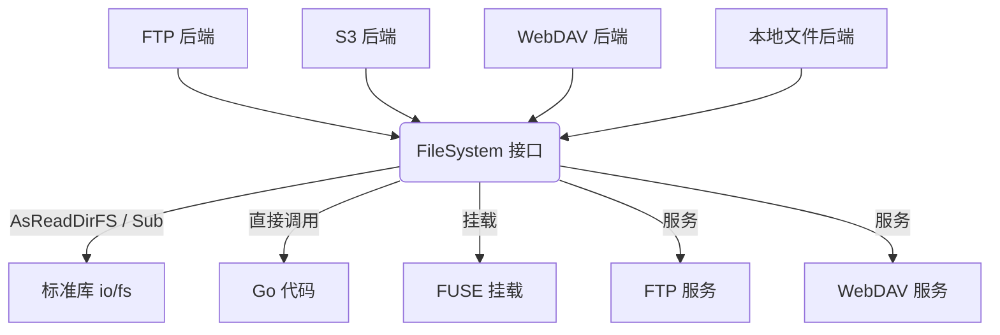

# UniFS

UniFS 提供可复用的统一文件系统抽象，用同一套 `FileSystem` 接口接入本地文件、FTP、WebDAV 和 S3 兼容存储。仓库核心是 `pkg/filesystem`：它复用 `golang.org/x/net/webdav.FileSystem` 语义，并补充标准库 `io/fs` 适配、路径裁剪、共享一致性测试和后端实现。

`internal/cmd/unifs` 只是本仓库的示例与装配入口。把 UniFS 当库使用时，应优先阅读 `pkg/filesystem` 及其后端包，而不是从 CLI 入口反推公共能力。


```mermaid
flowchart TB
    s3_fs[S3 后端]
    ftp_fs[FTP 后端]
    local_fs[本地文件后端]
    webdav_fs[WebDAV 后端]
    fsi(FileSystem 接口)
    ftp_fs & s3_fs & webdav_fs & local_fs --> fsi
    std_fs[标准库 io/fs]
    webdav_server[WebDAV 服务]
    ftp_server[FTP 服务]
    fuse_fs[FUSE 挂载]
    go_code[Go 代码]
    fsi -->|AsReadDirFS / Sub| std_fs
    fsi -->|直接调用| go_code
    fsi -->|挂载| fuse_fs
    fsi -->|服务| ftp_server
    fsi -->|服务| webdav_server
```

## 职责边界

- `pkg/filesystem` 是主要公共 API，提供 `FileSystem`、`File`、`FileInfo`、`AsReadDirFS`、`Sub`、`ReadDir`、`WalkDir` 等能力。
- `pkg/filesystem/{local,ftp,s3,webdav}` 是不同存储协议的后端实现，对外仍收敛到统一文件系统接口。
- `pkg/filesystem/testutil` 提供后端一致性测试，后端新增或调整时应优先复用这里的共享测试。
- `pkg/fuse` 和 `pkg/ftp` 把文件系统层接入 FUSE 与 FTP 服务。
- `internal/cmd/unifs` 负责示例性 CLI 装配与本地运行流程，不作为库边界。
- `tool/go/justfile` 暴露 Go 工具链任务；根 `justfile` 聚合仓库级稳定入口。

UniFS 不是通用对象存储 SDK。除非某个包明确暴露协议能力，后端差异应尽量留在统一文件系统接口之后。

## 阅读入口

- [`pkg/filesystem/doc.go`](pkg/filesystem/doc.go) 说明核心接口、标准库适配关系和路径约定。
- [`pkg/filesystem/fs.go`](pkg/filesystem/fs.go) 定义公共 `FileSystem` 接口别名，这是后端实现和调用方共同依赖的边界。
- [`pkg/filesystem/fs_std.go`](pkg/filesystem/fs_std.go) 提供面向 `io/fs` 的只读适配。
- [`pkg/filesystem/fs_sub.go`](pkg/filesystem/fs_sub.go) 提供以子目录为根的文件系统视图。
- [`pkg/filesystem/testutil`](pkg/filesystem/testutil) 提供后端一致性测试，适合验证新后端是否满足统一语义。
- [`pkg/filesystem/ftp`](pkg/filesystem/ftp)、[`pkg/filesystem/s3`](pkg/filesystem/s3)、[`pkg/filesystem/webdav`](pkg/filesystem/webdav)、[`pkg/filesystem/local`](pkg/filesystem/local) 是具体后端实现；理解后端差异时优先从这里进入。

## 标准库适配

`pkg/filesystem` 面向标准库提供只读适配：

- `AsReadDirFS(fsys)` 将 UniFS 的 `FileSystem` 适配为 `io/fs.ReadDirFS`。
- `Sub(fsys, dir)` 返回以 `dir` 为根的文件系统视图，可继续配合 `fs.Sub`、`fs.ReadFile`、`fs.Stat`、`fs.ReadDir` 和 `fs.WalkDir` 使用。
- 对标准库暴露的 `FileInfo.Name()` 和 `DirEntry.Name()` 会按 `io/fs` 约定返回基础文件名，而不是后端完整路径。
- 标准库路径使用不带前导 `/` 的 slash-separated name；底层 `FileSystem` 仍兼容 WebDAV 风格路径。

## 后端端点

```
ftp://<username>:<password>@<host>[<base_path>]

webdav://<username>:<password>@<host>[<base_path>][?insecure=true]

s3://<access_key_id>:<access_key_secret>@<host>/<bucket>[<base_path>][?insecure=true]

file://<absolute_path>
```

## 运行入口

- 使用 `just --list --list-submodules` 查看仓库稳定执行入口。
- 使用 `just go test` 运行 Go 测试入口。
- 使用 `just go test ./pkg/...` 只验证公共包。
- 本地挂载或服务示例可通过根 `justfile` 下的 `unifs:*` recipe 或 `go tool unifs` 运行。
